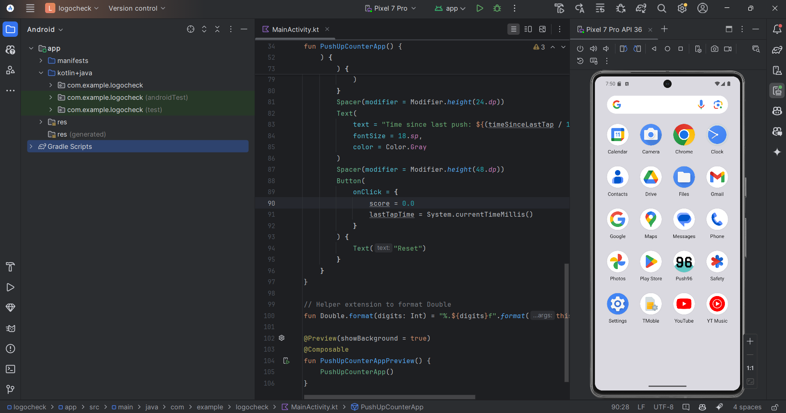

# What I Learned from This Android Project

## 1. App Name vs. Project Name

- The **app name** displayed on the device (launcher, app switcher) is defined in the `app/src/main/res/values/strings.xml` file under the `app_name` string.
- The **project name** in Android Studio can be completely different from the app name and is just the folder or project title in your IDE.

## 2. Changing the App Icon

- The app icon can be changed by adding a new image asset in Android Studio.
- This is done by right-clicking the `res` folder, selecting **New > Image Asset**, and following the wizard to set a custom icon.

## 3. Screenshot

Below is a screenshot of the project in Android Studio:

